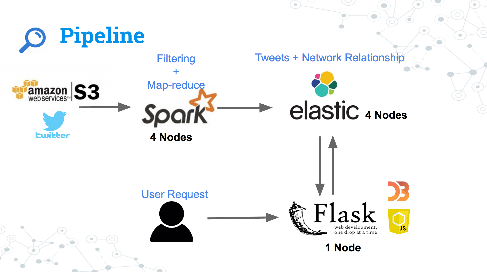

# SEEi
Developed by: Yan Jiang
Date: Feb, 2017

SEEi is a search tool that give you the power to search messages on social media, and become more engaged with your interested topics or people. Specifically, it allow you to search any topic, within a time range, and for specific users, with that you can become more engaged with that topic, or the people who talk about it. Another cool feature is, you can not only see how you or someone talk about a topic, but also explore what is your impact. 

This tool is built on twitter data, but can easily be applied to other social-media message system as well.

Web tool link: http://www.seei.site/

Data pipeline presentation: http://www.seei.site/ppt

Youtube demo show: https://youtu.be/voGMpNQXu30

## What you can do with SEEi
Search any one that you want to stalk, by:

User ID: this is the ID that you want to log in. Sample user IDs are provided in case you want to quickly jump in a search.

Keyword: a single object (e.g., number, or words)

Time Window: the time range that you are interested in 

Social Network: the user and follower relationship graph

## Data Source
Twitter data is stored on S3 (2015-05 to 2015-08). 

Data Size: 1.4 TB

## Data Pipeline
Twitter data is stored and read from S3. Spark filtered the data and implemented a map-reduce job by a 4 node cluster. Spark cluster writes to an elasticsearch cluster which is set up on 4 node cluster. 

The front end is served with a flask app (single node cluster) which interacts with elasticsearch clusters.
